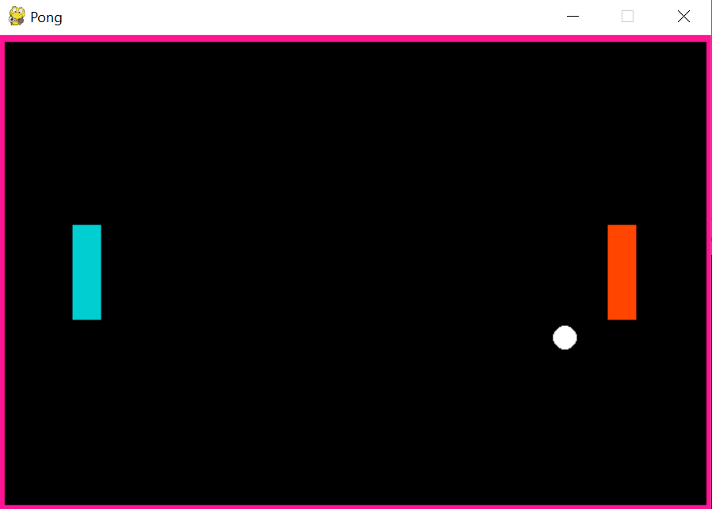
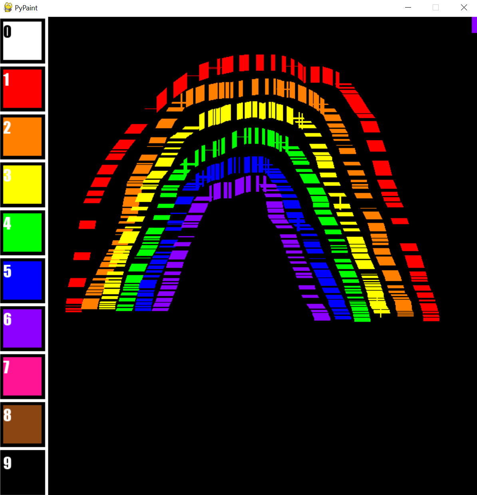

<h1>Video Games and Art Workshop 🎓</h1>

Educational materials for a Rutgers Google DSC youth program on Video Games and Art intended for middle-schoolers. The languages used in the program were <strong>Python</strong> (using pyGame) and <strong>Java</strong> (using Applets -> JavaFX).

<h3>Games 🎮</h3>

* Java 3D TicTacToe 🟢 - A simple introduction to turning code into pictures. If-else logic and display of simple shapes to the screen are explored.

* PyPong + Java Pong 🕹️ - Students are challenged to grapple with continuous, dynamic on-screen updates. We start off building the basic mechanics of the game, and then move on to features of convenience and/or style (i.e. a pause screen, color palette shifting, etc.)

* PyGalaxo 👾 - A reimagining of the arcade classic Space Invaders , with minimalist polygonal rocket ships. Introduces arrays and pseudorandom number generation and provokes thought about computationally efficient rendering/memory management. Shoot to win!

  

<h3>Art 🎨</h3>

* PyPaint 🖌️ - An MSPaint-like application with basic drawing functionality. Advanced students are encouraged to invent and implement their own product features (with instructor help), like saving compositions, changing brush thickness/texture, etc.

  

